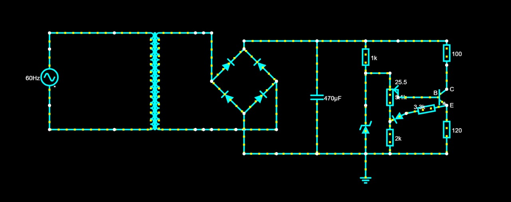
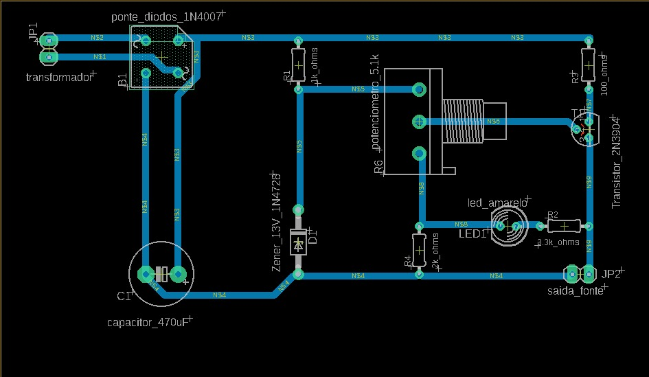
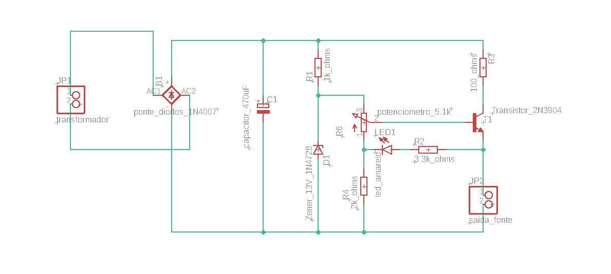
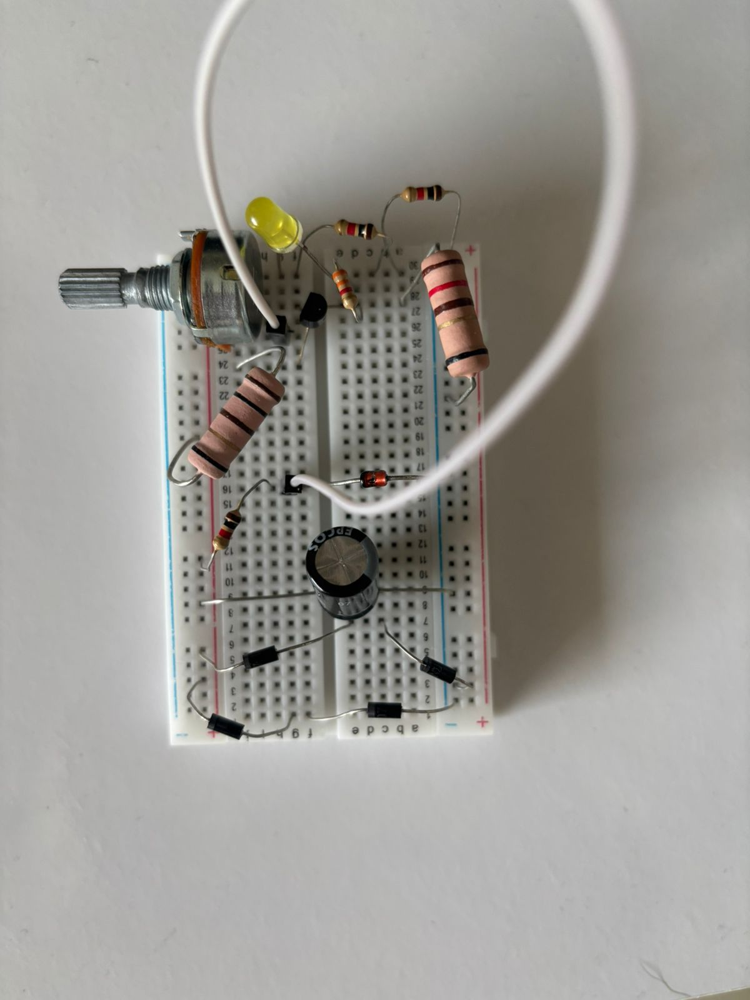
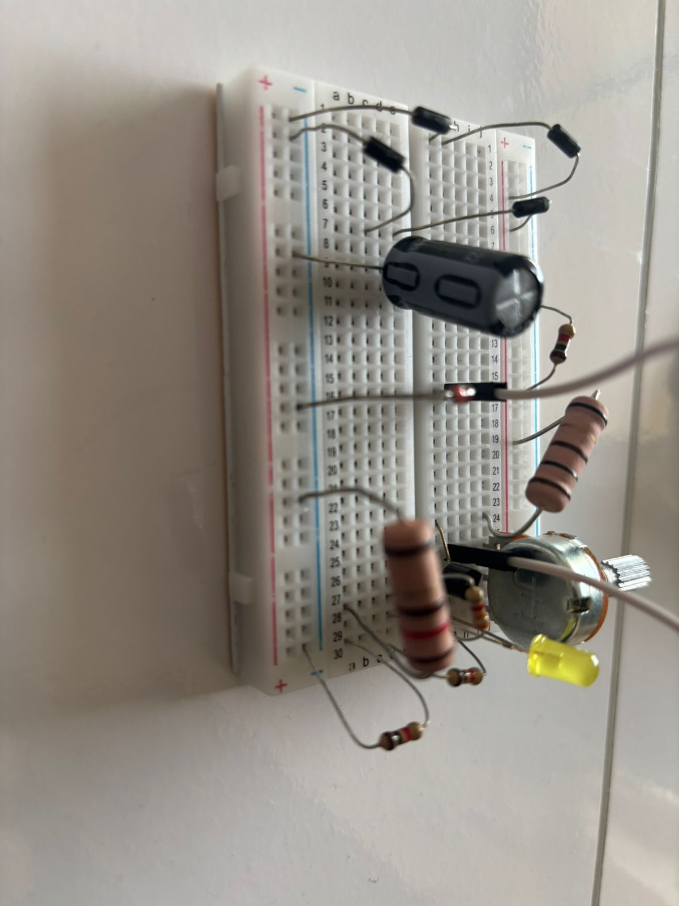
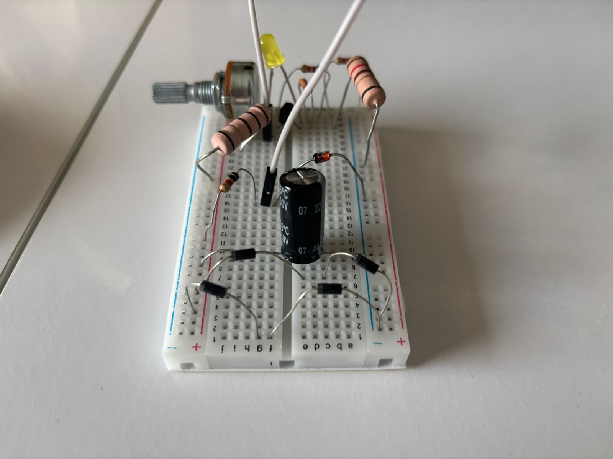

# Trabalho Fonte de Tensão Ajustável

*Trabalho da Disciplina Eletronica para Computação - SSC0180*

# Sobre o Projeto
Este trabalho descreve o projeto e a construção de uma fonte de alimentação ajustável. A fonte converte a tensão alternada da rede elétrica em uma tensão contínua regulável na faixa de 3V a 12V, com capacidade de corrente de até 100mA. O circuito foi inicialmente simulado utilizando os softwares Falstad e Eagle e, em seguida, montado fisicamente, conforme detalhado nesta página.

# Tabela dos Componentes
| Componente | Quantidade | Custo Unitário |
| :----: | :----: | :----: |
|diodo zener 13v 1w|1|R$0,50|
|capacitor 470uF|1|R$4,40|
|diodo|4|R$0,20|
|potenciometro|1|R$7,00|
|resistor 100 (5W)|1|R$1,90|
|resistor 2k2|1|R$0,07|
|resistor 3k3|1|R$0,07|
|resistor 1k|1|R$0,07|
|transistor|1|R$0,80|
|protoboard|1|R$1,60|
| | **`TOTAL:`** | **`R$17,21`** |

# Sobre os Componentes
- **Transformador**: Reduz a alta tensão da rede elétrica (127V, corrente alternada) para um nível de tensão alternada mais baixo e seguro, adequado para o circuito.
- **Ponte de Diodo**: Composta por quatro diodos, sua função é converter a tensão alternada, vinda do transformador, em uma tensão contínua pulsante. Esse processo é conhecido como retificação de onda completa.
- **Capacitor**: armazena carga no circuito nos ciclos da corrente alternada, liberando corrente quando a tensão da fonte é menor do que a tensão interna. ele descarrega sua carga armazenada quando há a inversão do ciclo no circuito. com base em cálculos de um ripple de 10%, chegamos próximos do valor comercial de 470uF de capacitância, usando um capacitor com esse valor no projeto.
- **Diodo Zener**: Funciona como um regulador de tensão de referência. No projeto, ele garante uma tensão estável de 13V que servirá de base para o circuito de controle, assegurando que a fonte não ultrapasse os limites projetados.
- **Potenciômetro**: É um resistor variável que atua como o principal controle do usuário. Ao ajustar o potenciômetro, varia-se a tensão de referência enviada ao transistor, permitindo que a tensão de saída seja ajustada na faixa desejada de 3V a 12V.
- **Transistor**: É o principal componente regulador da fonte. Ele atua como uma resistência variável controlada, ajustando continuamente a passagem de corrente para manter a tensão de saída estável no valor definido pelo potenciômetro, com capacidade para fornecer até 100mA.
- **Resistores**: Componentes usados em diversos pontos do circuito para limitar a corrente e polarizar outros componentes. Eles protegem o LED e o diodo zener de corrente excessiva e trabalham em conjunto com o potenciômetro e o transistor para garantir o funcionamento correto do circuito de regulação.
- **Led**: Serve como um indicador visual de que a fonte está ligada e em operação. Sua principal função é sinalizar o funcionamento do circuito.

# Imagem do Circuito no Falstad

   - link para o falstad: https://tinyurl.com/2cbdos5r

# PCB no Eagle

# Esquemático no Eagle

# Vídeo do funcionamento e Fotos da Fonte
- Vídeo explicando o funcionamento da fonte: Ainda a ser lançado

Video a ser lançado

# Membros
- Matheus Gregório Muniz Arcanjo - 16892051
- Rafael Said Jannini - 16898162
- Luiz Felipe Manzoli Franceschini - 16913300
