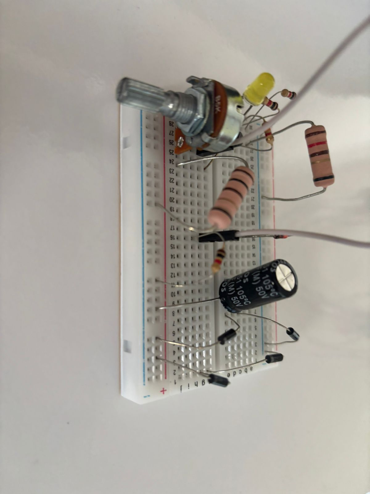

# Trabalho Fonte de Tensão Ajustável

*Trabalho da Disciplina Eletronica para Computação - SSC0180*

# Sobre o Projeto
Este trabalho descreve o projeto e a construção de uma fonte de alimentação ajustável. A fonte converte a tensão alternada da rede elétrica em uma tensão contínua regulável na faixa de 3V a 12V, com capacidade de corrente de até 100mA. O circuito foi inicialmente simulado utilizando os softwares Falstad e Eagle e, em seguida, montado fisicamente, conforme detalhado nesta página.

# Tabela dos Componentes
| Componente | Quantidade | Custo Unitário |
| :----: | :----: | :----: |
|diodo zener 13v 1w|1|R$0,50|
|capacitor 470uF|1|R$4,40|
|diodo|4|R$0,20|
|potenciometro|1|R$7,00|
|resistor 100 (5W)|1|R$1,90|
|resistor 2k2|1|R$0,07|
|resistor 3k3|1|R$0,07|
|resistor 1k|1|R$0,07|
|transistor|1|R$0,80|
|protoboard|1|R$1,60|
| | **`TOTAL:`** | **`R$17,21`** |

# Sobre os Componentes
- **Transformador**: Reduz a alta tensão da rede elétrica (127V, corrente alternada) para um nível de tensão alternada mais baixo e seguro, adequado para o circuito.
- **Ponte de Diodo**: Composta por quatro diodos, sua função é converter a tensão alternada, vinda do transformador, em uma tensão contínua pulsante. Esse processo é conhecido como retificação de onda completa.
- **Capacitor**: armazena carga no circuito nos ciclos da corrente alternada, liberando corrente quando a tensão da fonte é menor do que a tensão interna. ele descarrega sua carga armazenada quando há a inversão do ciclo no circuito. com base em cálculos de um ripple de 10%, chegamos próximos do valor comercial de 470uF de capacitância, usando um capacitor com esse valor no projeto.
- **Diodo Zener**: Funciona como um regulador de tensão de referência. No projeto, ele garante uma tensão estável de 13V que servirá de base para o circuito de controle, assegurando que a fonte não ultrapasse os limites projetados.
- **Potenciômetro**: É um resistor variável que atua como o principal controle do usuário. Ao ajustar o potenciômetro, varia-se a tensão de referência enviada ao transistor, permitindo que a tensão de saída seja ajustada na faixa desejada de 3V a 12V.
- **Transistor**: É o principal componente regulador da fonte. Ele atua como uma resistência variável controlada, ajustando continuamente a passagem de corrente para manter a tensão de saída estável no valor definido pelo potenciômetro, com capacidade para fornecer até 100mA.
- **Resistores**: Componentes usados em diversos pontos do circuito para limitar a corrente e polarizar outros componentes. Eles protegem o LED e o diodo zener de corrente excessiva e trabalham em conjunto com o potenciômetro e o transistor para garantir o funcionamento correto do circuito de regulação.
- **Led**: Serve como um indicador visual de que a fonte está ligada e em operação. Sua principal função é sinalizar o funcionamento do circuito.

# Imagem do Circuito no Falstad

   - link para o falstad: https://tinyurl.com/264bqyp6

# PCB no Eagle


# Esquemático no Eagle


# Vídeo do funcionamento e Fotos da Fonte
- Vídeo explicando o funcionamento da fonte: https://youtu.be/jIqwZMUt0rg





# Cálculos:

## 1. Cálculo da Razão das Espiras (Np/Ns)

A razão entre as espiras do primário (Np) e do secundário (Ns) é igual à razão entre suas respectivas tensões (Vp e Vs).

* **Tensão no Primário (`Vp`):** `127V` (RMS)
* **Tensão no Secundário (`Vs`):** `127V / 7 ≈ 18,14V` (RMS)
* **Cálculo da Razão:**
    ```
    Np/Ns = Vp/Vs = 127V / 18,14V ≈ 7,0
    ```
* **Conclusão:** A razão das espiras é de aproximadamente **7:1**.

## 2. Tensão de Pico

* **Pico no Primário:**
    ```
    V_pico(prim) = Vp(RMS) * √2 = 127V * 1,414 ≈ 179,6V
    ```
* **Pico no Secundário:**
    ```
    V_pico(sec) = Vs(RMS) * √2 = 18,14V * 1,414 ≈ 25,65V
    ```

## 3. Tensão no Capacitor de Filtro (`VC`)

Considera-se a queda de tensão em dois diodos da ponte retificadora (`~0,7V` cada).

* **Cálculo:**
    ```
    VC = V_pico(sec) - (2 * V_diodo) = 25,65V - 1,4V = 24,25V
    ```

## 4. Corrente de Carga (`I_carga`)

Calculada com base em uma resistência de carga de `120Ω`.

* **Corrente Máxima (em 12,3V):**
    ```
    I_max = V_out(max) / R_carga = 12,3V / 120Ω = 0,1025A ou 102,5mA
    ```
* **Corrente Mínima (em 3V):**
    ```
    I_min = V_out(min) / R_carga = 3V / 120Ω = 0,025A ou 25mA
    ```

## 5. Cálculo da Capacitância de Filtro (`C_min`)

Para uma tensão de ondulação (`ripple`) alvo de 10% da tensão do capacitor (`V_ripple = 2,425V`) e frequência de `120Hz`.

* **Cálculo:**
    ```
    C_min = I_max / (f_ripple * V_ripple) = 0,1025A / (120Hz * 2,425V) ≈ 352µF
    ```
* **Conclusão:** O capacitor de `470µF` é adequado para essa situação.

## 6. Cálculo do Resistor do Zener (R1)

Determinação da faixa de operação segura para o resistor `R1` (`1kΩ`).

* **Resistência Mínima (`R_min`):** Para proteger o Zener em corrente máxima (`~77mA`).
    ```
    R_min = (VC - VZ) / I_Z(max) = (24,25V - 13V) / 0,077A ≈ 146Ω
    ```
* **Resistência Máxima (`R_max`):** Para garantir a regulação em corrente mínima (`~7,8mA`).
    ```
    R_max = (V_C(min) - VZ) / I_total(min) = (21,8V - 13V) / 0,0078A ≈ 1131Ω ou 1,13kΩ
    ```
* **Conclusão:** O valor de `1kΩ` que utilizamos está dentro da faixa permitida.

## 7. Cálculo da Faixa de Tensão de Saída (`V_out`)

A tensão de saída é a tensão na base do transistor (`VB`) menos a queda base-emissor (`VBE ≈ 0,7V`).

* **Tensão de Saída Mínima:**
    ```
    V_B(min) = VZ * (R4 / (R6 + R4)) = 13V * (2kΩ / (5,1kΩ + 2kΩ)) ≈ 3,66V
    V_out(min) = V_B(min) - VBE = 3,66V - 0,7V = 2,96V
    ```
* **Tensão de Saída Máxima:**
    ```
    V_B(max) = VZ = 13V
    V_out(max) = V_B(max) - VBE = 13V - 0,7V = 12,3V
    ```

## 8. Cálculo de Potência Dissipada em R3

Análise de segurança para o resistor `R3` (`100Ω`) na condição de corrente máxima.

* **Cálculo:**
    ```
    P_R3 = R3 * IC² ≈ 100Ω * (0,1025A)² ≈ 1,05W
    ```

# Membros
- Matheus Gregório Muniz Arcanjo - 16892051
- Rafael Said Jannini - 16898162
- Luiz Felipe Manzoli Franceschini - 16913300
